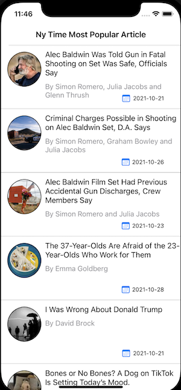
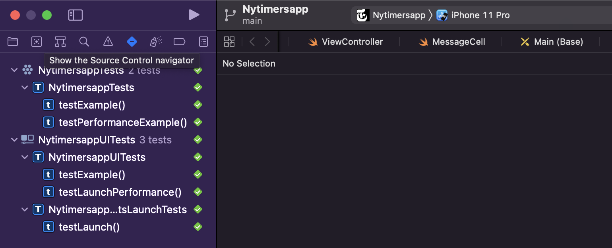

# Nytimesapp

## Description
 Build a simple app to hit the NY Times Most Popular Articles API and show a list of articles,
that shows details when items on the list are tapped detail app . This project builded using Swift 5
it a sample design 
## youtube link
this youtube link for explain the project : https://youtu.be/8kNbm5UZmCE

## Xcode Details :
 - Xcode 13
 - Swfit 5
 - Ios 15.0
## Home Image

## GIF

## UNit Test and UI

## API Details:

 -  Base Url = https://api.nytimes.com/svc/mostpopular/v2/mostviewed/all-sections/7.json?api-key=
 -  Api-Key : An55tTl23wCgXd2jASDZIxvdYT55fhI7
 -   we can change all-section , mostviewed or 7 but for this project i work what values
 
 ## Details
 
 -  Create a new project in Xcode.
 -  The app should open to a view controller with a table view embedded in a navigation controller.
 -  the tableview use a custom cell or  Nib XIB
 -  There should be a search bar at the top, where a user can tap into and type a search term.
 -  As the user types in the search bar it should dynamically populate a tableview.
 -  For each article returned from the response, the table view cell should have the article headline and a thumbnail image from that article.
 -  When a user taps on an article, it should push a detail view controller  present some details about that article.
